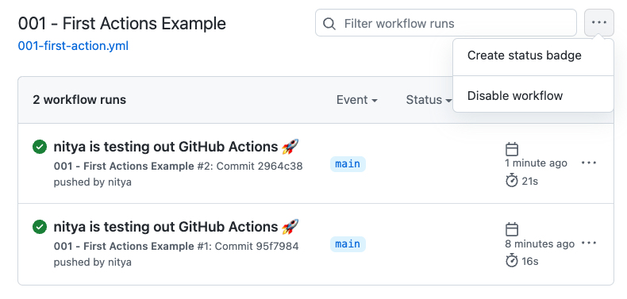

:::info RESOURCES
 - [Quickstart for GitHub Actions](https://docs.github.com/en/actions/quickstart)
:::

## Setup

1. Create `.github/workflows/001-first-action.yml` and copy in the following code.
2. commit the changes to your repo.
3. Visit the [GitHub Actions Dashboard](https://github.com/30DaysOf/github-actions/actions/) to see actions associated with this repo
4. You should see [GitHub Actions Demo](https://github.com/30DaysOf/github-actions/actions/workflows/001-first-action.yml) as one of the workflows
    - Click to see history of runs for this workflow (should be 1 = first run)
    - History should show `001-first-action.yml` as source file - click to see code

```
name: GitHub Actions Demo
run-name: ${{ github.actor }} is testing out GitHub Actions 🚀
on: [push]
jobs:
  Explore-GitHub-Actions:
    runs-on: ubuntu-latest
    steps:
      - run: echo "🎉 The job was automatically triggered by a ${{ github.event_name }} event."
      - run: echo "🐧 This job is now running on a ${{ runner.os }} server hosted by GitHub!"
      - run: echo "🔎 The name of your branch is ${{ github.ref }} and your repository is ${{ github.repository }}."
      - name: Check out repository code
        uses: actions/checkout@v3
      - run: echo "💡 The ${{ github.repository }} repository has been cloned to the runner."
      - run: echo "🖥️ The workflow is now ready to test your code on the runner."
      - name: List files in the repository
        run: |
          ls ${{ github.workspace }}
      - run: echo "🍏 This job's status is ${{ job.status }}."
```

## Experiments

| Action | Outcome |
|:---|:---|
|Try changing the 'name` in the actions workflow YAML file to "001 - First Actions Example" - what happens? | The [Actions dashboard](https://github.com/30DaysOf/github-actions/actions) should show the updated name for that flow.|
|  <br/> Go to the [specific workflow page](https://github.com/30DaysOf/github-actions/actions/workflows/001-first-action.yml) in GitHub Actions dashboard and click "Disable workflow" as shown, then commit changes. | |
| | | 